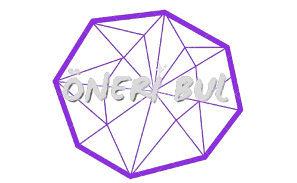
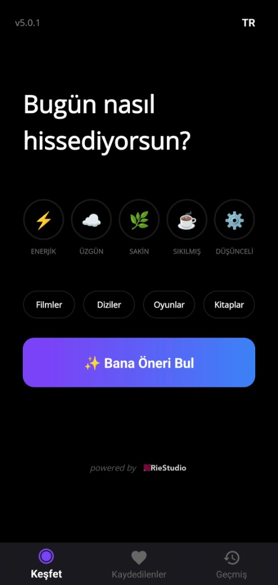
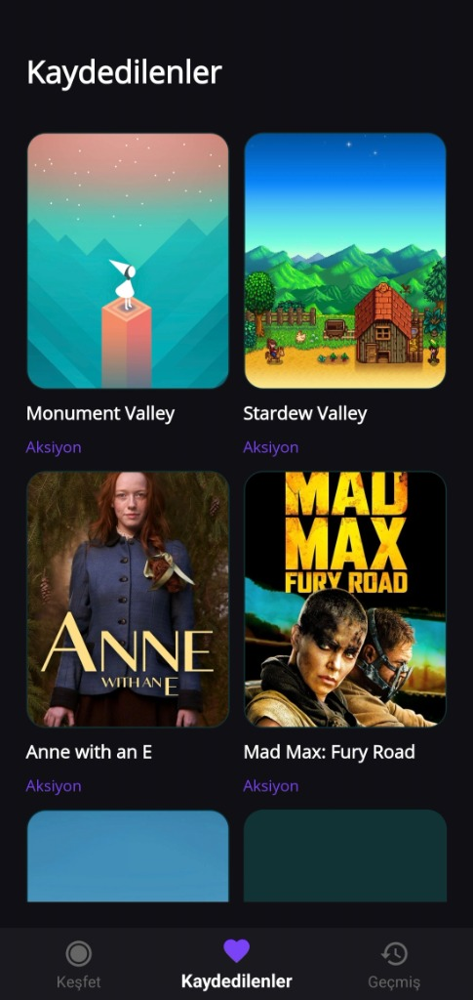
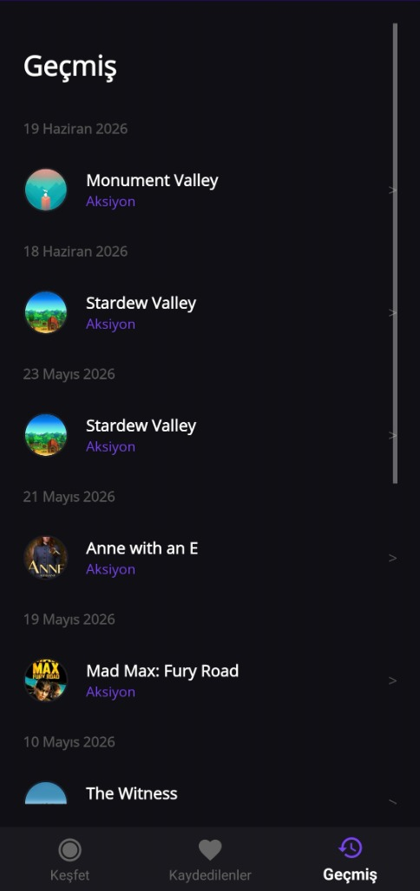

# Oneri Bul

<p align="center">
  
</p>

<p align="center">
  
  
  
  
</p>

<p align="center">
Developed by <a href="https://github.com/RieStudio">RieStudio</a>
</p>

## Overview

"Oneri Bul" is an AI-powered recommendation app that helps users discover films, books and games based on their current mood. Rather than having to scroll through endless lists one by one, users simply select how they’re feeling; the app then analyses this information and provides personalised recommendations within seconds.

---

## Screenshots

<p align="center">
  
  
  
</p>

---

## Features

- AI-powered recommendations
- Mood-based recommendation engine
- Movie, book, and game suggestions
- Smart category selection
- Clean Material Design interface
- Cross-platform support with .NET MAUI
- Fast and responsive user experience
- Lightweight and modern architecture
- Persistent user preferences

---

## Architecture

The project follows the **MVVM (Model-View-ViewModel)** architecture to provide a clear separation of concerns and improve maintainability.

- **Views** – User interface built with .NET MAUI XAML.
- **ViewModels** – Manage UI state, user interactions, and application logic.
- **Models** – Define the application's data structures.
- **Services** – Handle AI communication, external APIs, local storage, and business logic.
- **Converters** – Transform data for UI presentation.
- **Resources** – Store application assets, styles, fonts, and icons.

This architecture keeps the codebase modular, scalable, and easy to maintain while supporting future feature expansion.

---

## Tech Stack

| Category | Technology |
|----------|------------|
| **Framework** | .NET MAUI |
| **Language** | C# |
| **Architecture** | MVVM |
| **AI Model** | Google Gemini |
| **Movie Database** | TMDb |
| **Book Database** | Google Books |
| **Game Database** | RAWG |

---

## Getting Started

Clone the repository.

```bash
git clone https://github.com/RieStudio/OneriBul.git
```

Open the project in Android Studio and run the Android target.

---

## License

This project is licensed under the [MIT License](LICENSE).


